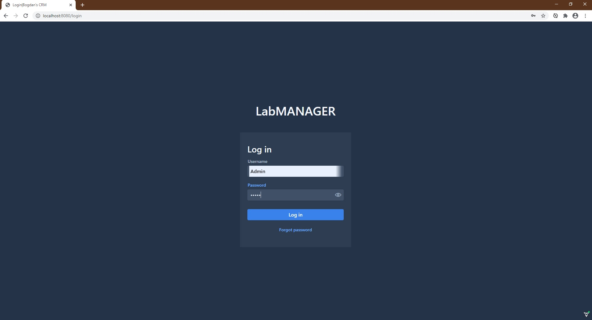

### Creating the database for the project

Before starting the project create a PostgreSQL database. You can give it any name (ex: "lab-manager-database")

In the application.properties file update the name of the database used for the project.

After the first run of the application all the necessary tables are created.
Make the following queries on the database:

insert into role values ('1', 'ADMIN');

insert into role values ('2', 'MICROBIOLOGIST');

insert into users values ('1', '1', 'john.smith@labmanager.com', 
'true', 'John', 'Smith', '$2a$04$7YT/pMWkuQHQzc2Odg4szOVLk6qO8N6K/WYBu7HrdBQcWytEUvX22', 'Admin', '1');

### Logging into the application

Username: Admin

Password: admin

